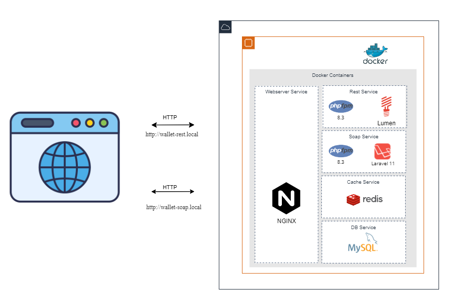
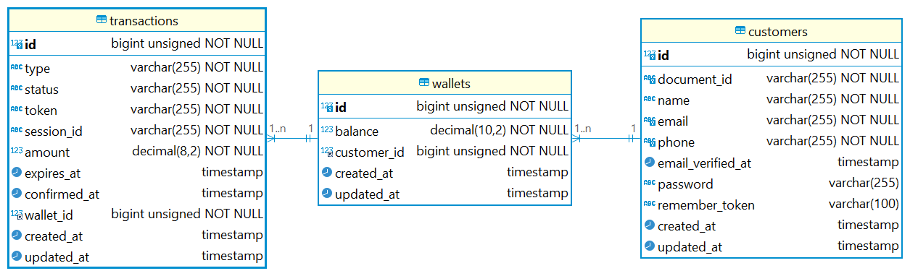

# Wallet Service API - REST & SOAP

Este repositorio contiene dos servicios de billetera (wallet) virtual que interactúan utilizando diferentes protocolos: **REST** y **SOAP**. El sistema está desplegado utilizando **Docker** para un entorno fácilmente reproducible.

## Descripción del Proyecto

El sistema tiene dos API principales:

- **REST API** (Laravel 11): Se utiliza para operaciones RESTful como la gestión de cuentas de usuario y transacciones.
- **SOAP API** (Lumen): Expone servicios a través de SOAP para las mismas operaciones, proporcionando un enfoque más estandarizado para aplicaciones que utilizan este protocolo.


Ambos servicios están desplegados dentro de un contenedor Docker utilizando **PHP-FPM** y están gestionados por **NGINX** como proxy inverso. Redis se utiliza como servicio de caché y MySQL como base de datos relacional.

## Arquitectura



- **Webserver Service** (NGINX): Enruta las peticiones HTTP y actúa como un proxy inverso para los servicios REST y SOAP.
- **SOAP Service**: Implementado en **Lumen** (PHP 8.3), expone los servicios SOAP.
- **REST Service**: Implementado en **Laravel 11** (PHP 8.3), expone los servicios RESTful.
- **Cache Service**: **Redis** se utiliza para almacenamiento en caché de datos temporales.
- **DB Service**: **MySQL** es la base de datos relacional que almacena la información de la billetera y las transacciones.

## Modelos de Datos



## Endpoints Disponibles

- **REST API**: [http://wallet-rest.local](http://wallet-rest.local)
- **SOAP API**: [http://wallet-soap.local](http://wallet-soap.local)
- **POSTMAN**: [Postman](https://www.postman.com/teamluis/reto-interfell-epayco)

## Requisitos Previos

Asegúrate de tener instalados los siguientes programas:

- [Docker](https://www.docker.com/)
- [Docker Compose](https://docs.docker.com/compose/)

## Instalación

1. Clonar este repositorio:

   ```bash
   git clone https://github.com/luiseah/interfell-ePayco.git
   ```

2. Crear el archivo `.env` para las configuraciones de Docker y las aplicaciones:

   ```bash
   cp .env.example .env
   ```

3. Iniciar los contenedores:

   ```bash
   docker-compose up -d
   ```

4. Ejecutar las migraciones de la base de datos de soap servicios:

    - Para **SOAP API (Lumen)**:

      ```bash
      docker-compose exec wallet-soap php artisan migrate
      ```

## Uso

### REST API

La **REST API** puede ser probada utilizando herramientas como **Postman** o **cURL**. A continuación un ejemplo básico para obtener las billeteras:

```bash
curl -X GET http://wallet-rest.local/api/wallets
```

### SOAP API

La **SOAP API** expone un archivo **WSDL** que describe los servicios SOAP disponibles. Puedes acceder al WSDL en:

```bash
http://wallet-soap.local/api/wallet/wsdl
```

Para consumir los servicios SOAP, puedes utilizar un cliente compatible con SOAP como **SoapUI** o cualquier otro que soporte WSDL.

## Servicios Disponibles

- **NGINX**: Gestiona el tráfico HTTP entre los servicios y los usuarios.
- **Redis**: Se utiliza para caché de datos temporales. Puedes conectarte a Redis con:

- **MySQL**: Base de datos relacional utilizada para almacenar la información de la billetera y las transacciones. Puedes conectarte a MySQL con:

## Desarrollo

Si necesitas modificar el código o realizar pruebas dentro de los contenedores, puedes acceder a los servicios correspondientes:

- Para **REST API (Laravel)**:

  ```bash
  docker-compose exec rest bash
  ```

- Para **SOAP API (Lumen)**:

  ```bash
  docker-compose exec soap bash
  ```

Dentro del contenedor puedes ejecutar comandos de Artisan, PHPUnit, entre otros.

## Notas

1. **Configuración de Hosts**:
   Asegúrate de añadir las siguientes entradas en tu archivo `/etc/hosts` para poder acceder a los servicios por los dominios locales configurados:

   ```bash
   127.0.0.1 wallet-rest.local
   127.0.0.1 wallet-soap.local
   ```

   Esto permitirá que las solicitudes desde el navegador o herramientas como Postman se resuelvan correctamente.

2. **Puertos Docker**:
   Verifica que los puertos en el archivo `docker-compose.yml` no estén en uso en tu máquina local. Si es necesario, ajusta los puertos expuestos para evitar conflictos.

## Licencia

Este proyecto está bajo la licencia [MIT](LICENSE).
